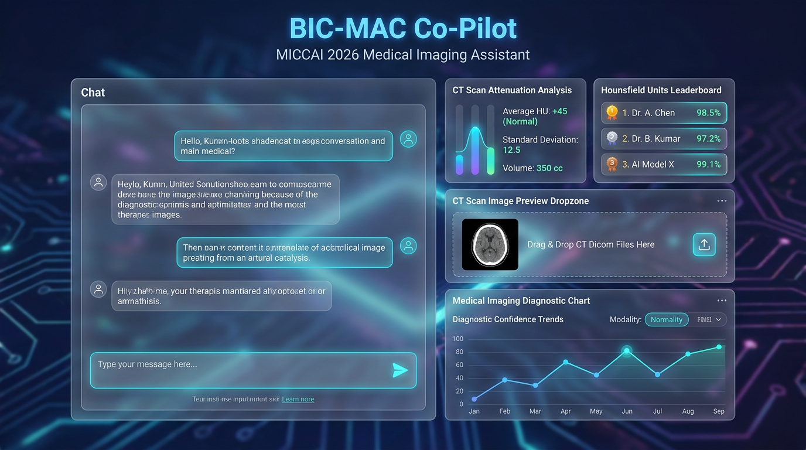

# BIC-MAC Medical Imaging Co-Pilot 🧠🏥
> **MICCAI 2026 Challenge Assistant for Cross-Modal Pseudo-CT Synthesis**



An AI-powered medical imaging co-pilot built with Google's **Agent Development Kit (ADK)** and deployed on **Vertex AI Agent Engine (Agent Runtime)**. Designed to assist computational biology researchers with cross-modal pseudo-CT synthesis, Hounsfield Unit (HU) attenuation evaluation, experiment logging, and grounded domain literature lookups.

---

## ✨ Key Features

### 1. 🖼️ Multimodal CT Scan Image Analysis
- Drag-and-drop upload zone for `.png`, `.jpg`, `.jpeg`, and DICOM CT slice previews.
- Multimodal Gemini 2.5 Flash agent inspects uploaded slices directly over the **A2A Protocol** to evaluate Hounsfield Unit dynamic range, bone-soft tissue contrast, and signal-to-noise ratios.

### 2. 📊 Real-Time Firestore Experiment Leaderboard
- Integrated with Google Cloud Firestore (`bic_mac_experiments` collection).
- Query leaderboard rankings (`list_experiments`) or record new model runs (`log_experiment`).

### 3. 🔍 Vertex AI RAG Knowledge Base Lookup
- Grounded document retrieval powered by **Vertex AI RAG Engine**.
- Instantly searches MICCAI domain literature, attenuation correction papers, and dataset documentation (`consult_knowledge_base`).

### 4. 🎨 Glassmorphic A2UI Rich UI Components
- Custom FastAPI proxy translating A2A streaming events into structured **A2UI v0.8** cards.
- Sleek glassmorphic dark-mode web frontend with micro-animations and glowing medical-cyan badges.

---

## 💡 Example Usage Queries

| Feature Area | Example User Query |
| :--- | :--- |
| **Firestore Leaderboard** | *"Show me all benchmarked model experiments from our Firestore leaderboard."* |
| **CT Image Inspection** | *[Upload CT Scan image]* + *"Analyze this uploaded CT slice for Hounsfield Unit distribution and noise artifacts."* |
| **Experiment Logging** | *"Log a new experiment exp-005-latent-diffusion for 3D-UNet with MAE 13.2, PSNR 35.8, SSIM 0.961."* |
| **Domain RAG Search** | *"What are the key attenuation correction challenges in whole-body PET/MRI synthesis?"* |
| **Challenge Metrics** | *"Evaluate attenuation metrics MAE 14.5, PSNR 34.2, SSIM 0.945 against BIC-MAC thresholds."* |

---

## 🛠️ Project Structure

```
bic-mac-copilot/
├── app/                        # Core ADK Agent Implementation
│   ├── agent.py                # Tools, system instructions & root_agent setup
│   ├── a2ui_utils.py           # A2UI callback helper (v0.8 schema)
│   └── app_utils/              # Helper utilities
├── frontend/                   # Web Interface & Proxy Server
│   ├── main.py                 # FastAPI proxy converting A2A stream to A2UI
│   └── static/                 # Glassmorphic UI HTML/CSS/JS
│       └── index.html          # Drag-and-drop CT upload + A2UI renderer
├── docs/                       # Project Documentation & Assets
│   └── ui_preview.png          # UI Screenshot
├── deployment_metadata.json    # Agent Platform deployment resource metadata
└── pyproject.toml              # Dependencies managed via `uv`
```

---

## 🚀 Quick Start

### 1. Prerequisites
- Python 3.12+
- [`uv`](https://docs.astral.sh/uv/) package manager
- [`agents-cli`](https://github.com/google/agents-cli) (`uv tool install google-agents-cli`)
- Google Cloud SDK authenticated with your GCP Project

### 2. Install Dependencies
```bash
agents-cli install
```

### 3. Run Frontend Proxy Locally
```bash
cd frontend
export AGENT_ENGINE_RESOURCE_NAME="<YOUR_REASONING_ENGINE_RESOURCE_NAME>"
export AGENT_DIRECTORY="app"
export PORT=8080

uv run python main.py
```
Open **`http://localhost:8080`** in your browser to interact with the Co-Pilot!

---

## 🌐 Deployment & Architecture

```
User Browser (HTML5/CSS3/JS)
      │
      ▼  (HTTP POST /chat with Base64 Image & Text)
FastAPI Proxy (`frontend/main.py`)
      │
      ▼  (A2A Protocol / gRPC stream over HTTPS)
Vertex AI Agent Engine (`bic-mac-copilot-v5`)
      │
      ├──► Firestore DB (`bic_mac_experiments`)
      ├──► Vertex AI RAG Engine (`ragCorpora/...`)
      └──► Gemini 2.5 Flash Multimodal Vision
```

### Deploy Agent to Agent Runtime
```bash
agents-cli deploy --service-name=bic-mac-copilot-v5 --project=<YOUR_PROJECT_ID> --region=us-central1
```

---

## 📜 License
Developed for the **Build with Gemini / MICCAI 2026** Challenge.
